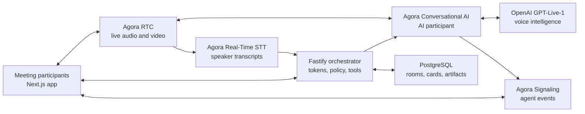

<div align="center">

# Agora Meeting Copilot

**A real-time meeting where an AI teammate can listen, respond, and take action.**

Built with Agora RTC, Agora Signaling, Agora Real-Time Speech-to-Text, Agora Conversational AI, and OpenAI GPT-Live-1.

[](./LICENSE)


**English** · [简体中文](./README.zh-CN.md)

</div>

---

Agora Meeting Copilot is a multi-participant meeting demo in which an AI teammate joins the same Agora RTC channel as everyone else. It can follow the live discussion, answer only when directly addressed, and use tools to create or update tasks on a shared Kanban board.

The app also produces speaker-attributed transcripts, live notes, final meeting notes, and downloadable Markdown artifacts. The AI is a real voice participant—not a separate text-chat panel—so people can collaborate with it naturally while the meeting continues.

## Demo Video

https://github.com/user-attachments/assets/0376ad2c-0a1f-4d9b-b9fa-b452b982e4e2

## Features

- Multi-participant audio and video meetings powered by Agora RTC.
- An optional AI teammate powered by OpenAI GPT-Live-1 and connected through Agora Conversational AI.
- A fresh wake phrase for every AI response, reducing accidental interruptions in team conversations.
- Speaker-attributed live transcription with Agora Real-Time Speech-to-Text.
- Shared live notes, final notes, and downloadable transcript/notes artifacts.
- A collaborative Kanban board with create, edit, assign, prioritize, tag, schedule, drag, filter, and search workflows.
- Voice-controlled board actions through typed AI tools.
- Real-time room, transcript, and board synchronization across participants.
- Short-lived server-generated RTC/RTM credentials; Agora and OpenAI secrets never reach the browser.
- An optional access gate for private demos.

## Architecture



### What each Agora product does

| Product | Role in this project |
| --- | --- |
| **Agora RTC** | Carries participant microphone, camera, and AI-generated audio in one low-latency channel. |
| **Agora Signaling (RTM)** | Delivers AI transcript and state events. The RTM user ID is the string form of the participant's numeric RTC UID. |
| **Agora Real-Time Speech-to-Text** | Subscribes to meeting audio and produces speaker-attributed captions for the shared transcript. |
| **Agora Conversational AI** | Starts and manages the AI agent that joins the same RTC channel as a voice participant. |

The Fastify orchestrator owns every privileged operation: it creates rooms, generates RTC/RTM tokens, starts or stops transcription and the AI agent, enforces the wake-phrase policy, executes approved board tools, and persists meeting state. The browser receives only short-lived, room-scoped credentials.

## Tech Stack

- Next.js 15 App Router and React 19
- Agora Web SDK NG (`agora-rtc-sdk-ng`)
- Agora Signaling Web SDK (`agora-rtm` v2)
- Agora Agent Client Toolkit
- Agora Conversational AI through the TypeScript `agora-agents` server SDK
- Agora Real-Time Speech-to-Text v7 and Protobuf data-stream captions
- OpenAI GPT-Live-1 for full-duplex voice interaction
- OpenAI Responses API for structured notes and delegated board tools
- Fastify, PostgreSQL, and Server-Sent Events
- Railway-ready orchestrator deployment
- Vitest and Playwright

## Prerequisites

- Node.js 22+
- An Agora project with an App ID and App Certificate
- Agora RTC and Signaling enabled for that project
- Access to Agora Conversational AI
- Agora REST credentials if you want server-side Real-Time Speech-to-Text
- An OpenAI API key with access to the GPT-Live-1 configuration used by this demo
- PostgreSQL for persistent production storage (local development can use memory storage)

> Before deploying, enable Agora Conversational AI for your Agora project and use an OpenAI API key with access to GPT-Live-1.

## Agora Configuration

### 1. Create and secure an Agora project

1. Sign in to the [Agora Console](https://console.agora.io/).
2. Create or select a project.
3. Copy its **App ID**.
4. Enable the **App Certificate** and copy it for the server configuration.

The App ID identifies the project. The App Certificate signs RTC and RTM tokens and must remain server-side. Never put the App Certificate in a `NEXT_PUBLIC_*` variable or commit it to Git.

### 2. Enable the required Agora services

Enable RTC and Signaling for the same Agora project. If you want the shared server-side transcript, enable Real-Time Speech-to-Text as well. Conversational AI must also be available to the project before the AI teammate can join.

RTC and RTM are separate systems even when they use the same channel name:

- RTC carries audio and video.
- RTM carries AI events and transcript metadata.
- Joining an RTC channel does not automatically subscribe a client to RTM.
- This app generates both credentials on the server and maps `rtcUid` to `String(rtcUid)` for RTM.

### 3. Create Agora REST credentials for transcription

In Agora Console, open **Developer Toolkit → RESTful API** and create or copy the **Customer ID** and **Customer Secret**.

These are account-level REST credentials. They are different from the App ID and App Certificate. Configure the pair only on the orchestrator:

```bash
AGORA_CUSTOMER_ID=
AGORA_CUSTOMER_SECRET=
```

Both values must be provided together. If both are blank, the app still runs, but Agora server-side transcription is disabled.

### 4. Keep service UIDs distinct

| Role | Default UID | Purpose |
| --- | ---: | --- |
| AI teammate | `900001` | Publishes GPT-Live-1 audio into the RTC meeting. |
| Speech-to-Text bot | `900003` | Subscribes to meeting audio for transcription. |

Do not assign these values to human participants. If you change the STT UID, update `AGORA_STT_PUBLISHER_UID` consistently.

## Quick Start

### 1. Install dependencies

```bash
git clone https://github.com/zicojiao/agora-meeting-copilot.git
cd agora-meeting-copilot
npm install

cd services/orchestrator
npm install
cd ../..
```

### 2. Configure the web app

```bash
cp .env.example .env.local
```

```bash
NEXT_PUBLIC_ORCHESTRATOR_URL=http://localhost:8787

# Optional private-demo gate. Leave both blank for public local access.
DEMO_ACCESS_PASSWORD=
DEMO_ACCESS_TOKEN=
```

### 3. Configure the orchestrator

```bash
cp services/orchestrator/.env.example services/orchestrator/.env
openssl rand -hex 32
openssl rand -hex 32
```

Use the generated values for `CAPABILITY_SECRET` and `WEBHOOK_SECRET`, then fill `services/orchestrator/.env`:

```bash
PORT=8787
NODE_ENV=development
PUBLIC_APP_URL=http://localhost:3000
ALLOWED_ORIGINS=http://localhost:3000

# Use memory locally. Use postgres plus DATABASE_URL in production.
STORAGE_DRIVER=memory
DATABASE_URL=

CAPABILITY_SECRET=<random-value-at-least-24-characters>
WEBHOOK_SECRET=<random-value-at-least-16-characters>

# Agora project credentials — server-side only.
AGORA_APP_ID=<32-character-app-id>
AGORA_APP_CERTIFICATE=<32-character-app-certificate>

# Optional, but required for Agora Real-Time Speech-to-Text.
AGORA_CUSTOMER_ID=
AGORA_CUSTOMER_SECRET=
AGORA_STT_PUBLISHER_UID=900003
AGORA_STT_LANGUAGES=en-US
AGORA_STT_MAX_IDLE_SECONDS=3600

# OpenAI credentials and model settings — server-side only.
OPENAI_API_KEY=
OPENAI_GPT_LIVE_GREETING=
OPENAI_GPT_LIVE_DELEGATION_MODEL=gpt-5.5
OPENAI_ANALYSIS_MODEL=gpt-5.4-mini

ROOM_TTL_HOURS=24
INSIGHT_COOLDOWN_SECONDS=90
```

The orchestrator validates required values on startup. `AGORA_CUSTOMER_ID` and `AGORA_CUSTOMER_SECRET` must either both be configured or both be blank.

### 4. Start the app

Start the orchestrator first:

```bash
cd services/orchestrator
set -a
source .env
set +a
npm run dev
```

In another terminal, from the repository root:

```bash
npm run dev
```

Open [http://localhost:3000](http://localhost:3000), create a meeting, and share its `?room=meet-...` URL with another participant.

## How the Meeting Works

1. The host creates a room through the orchestrator.
2. Each participant receives short-lived RTC and RTM credentials and joins the same room.
3. The first browser starts Agora Real-Time Speech-to-Text when REST credentials are configured.
4. The host can invite the AI teammate, which joins as RTC UID `900001`.
5. Every AI response requires a fresh direct wake phrase at the start of the user's turn.
6. The AI can answer in the meeting or call approved board tools. The orchestrator validates and executes each action before returning the result to the model.
7. Ending the meeting creates `meeting-transcript.md`, `meeting-notes.md`, and a ZIP containing both files.

Active meetings use `/?room=meet-...`. The board is available at `/board?room=meet-...`. Ended rooms open at `/summary?room=meet-...` and remain available for the configured room TTL (24 hours by default).

## Production Deployment

The application has two deployable parts:

1. **Next.js web app** — deploy to a Next.js-compatible host.
2. **Fastify orchestrator** — deploy the included Dockerfile to Railway or another Node.js container platform.

For Railway:

1. Create a service from this repository. `railway.json` builds `services/orchestrator/Dockerfile`.
2. Add PostgreSQL and set `STORAGE_DRIVER=postgres`; Railway supplies `DATABASE_URL` when linked.
3. Set all required variables from `services/orchestrator/.env.example`.
4. Set `PUBLIC_APP_URL` and `ALLOWED_ORIGINS` to the deployed web origin.
5. Railway provides `RAILWAY_PUBLIC_DOMAIN`; the app derives the secure GPT Live WebSocket URL from it. On another platform, set `GPT_LIVE_PROXY_PUBLIC_URL=wss://<orchestrator-host>` explicitly.
6. Set the web app's `NEXT_PUBLIC_ORCHESTRATOR_URL=https://<orchestrator-host>`.
7. Verify `/readyz` before opening a production meeting.

Production must use HTTPS/WSS and an enabled App Certificate. Do not deploy with Agora tokens disabled.

## License

This project is released under the [MIT License](./LICENSE).
