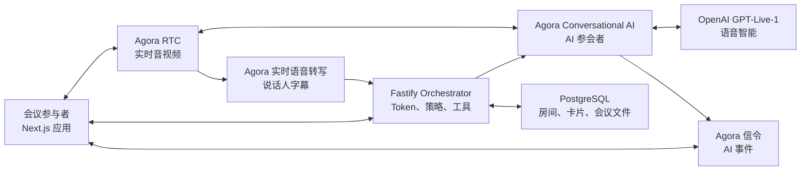

<div align="center">

# Agora Meeting Copilot

**一个能在实时会议中倾听、回答并执行任务的 AI 队友。**

基于 Agora RTC、Agora 信令、Agora 实时语音转写、Agora Conversational AI 和 OpenAI GPT-Live-1 构建。

[](./LICENSE)


[English](./README.md) · **简体中文**

</div>

---

Agora Meeting Copilot 是一个多人实时会议 Demo。AI 队友会像普通参会者一样加入同一个 Agora RTC 频道，理解现场讨论，只在被明确叫到时回答，并通过工具在共享看板上创建或更新任务。

应用还会生成带说话人信息的实时字幕、Live Notes、最终会议纪要和可下载的 Markdown 文件。AI 不是独立的文字聊天窗口，而是会议中的真实语音参与者，因此团队可以在会议继续进行的同时自然地与它协作。

## 演示视频

https://github.com/user-attachments/assets/0376ad2c-0a1f-4d9b-b9fa-b452b982e4e2

## 功能

- 基于 Agora RTC 的多人实时音视频会议。
- 通过 Agora Conversational AI 接入由 OpenAI GPT-Live-1 驱动的 AI 队友。
- 每次 AI 回答都需要新的唤醒词，减少多人讨论中的意外打断。
- 通过 Agora 实时语音转写生成带说话人信息的会议字幕。
- 共享 Live Notes、最终会议纪要，以及可下载的 transcript / notes 文件。
- 支持创建、编辑、指派、优先级、标签、日期、拖拽、筛选和搜索的协作看板。
- AI 通过类型明确的工具调用执行看板操作。
- 参会者之间实时同步房间、字幕和看板状态。
- RTC/RTM 凭证由服务端短期签发，Agora 和 OpenAI 密钥不会进入浏览器。
- 可选的私有 Demo 访问保护。

## 架构



### 每个 Agora 产品在项目中的作用

| 产品 | 作用 |
| --- | --- |
| **Agora RTC** | 在同一个低延迟频道中传输参会者的麦克风、摄像头和 AI 生成的声音。 |
| **Agora 信令（RTM）** | 将 AI transcript 和状态事件发送给客户端。RTM 用户 ID 使用参会者数字 RTC UID 的字符串形式。 |
| **Agora 实时语音转写** | 订阅会议音频，生成带说话人信息的字幕并进入共享 transcript。 |
| **Agora Conversational AI** | 启动并管理作为语音参会者加入同一 RTC 频道的 AI agent。 |

Fastify orchestrator 负责所有敏感和高权限操作：创建房间、生成 RTC/RTM Token、启动或停止转写和 AI agent、执行唤醒词策略、运行允许的看板工具，以及持久化会议状态。浏览器只能获得短期、限定房间使用的凭证。

## 技术栈

- Next.js 15 App Router 和 React 19
- Agora Web SDK NG（`agora-rtc-sdk-ng`）
- Agora 信令 Web SDK（`agora-rtm` v2）
- Agora Agent Client Toolkit
- 通过 TypeScript `agora-agents` 服务端 SDK 使用 Agora Conversational AI
- Agora 实时语音转写 v7 和 Protobuf data-stream captions
- OpenAI GPT-Live-1 全双工语音交互
- OpenAI Responses API 结构化纪要和看板工具委派
- Fastify、PostgreSQL 和 Server-Sent Events
- 支持 Railway 部署的 orchestrator
- Vitest 和 Playwright

## 前置条件

- Node.js 22+
- 一个包含 App ID 和 App Certificate 的 Agora 项目
- 该项目已启用 Agora RTC 和信令服务
- 已获得 Agora Conversational AI 使用权限
- 如需服务端实时语音转写，需要 Agora REST Customer ID / Customer Secret
- 邀请 AI 队友的主持人需要一个能够访问 GPT-Live-1 的 OpenAI API Key
- 生产环境使用 PostgreSQL；本地可以使用内存存储

> 公开部署默认使用 BYOK。主持人在邀请 AI 队友时输入自己的 OpenAI API Key；Key 只保存在当前浏览器标签页和服务端临时内存中。

## Agora 配置

### 1. 创建并保护 Agora 项目

1. 登录 [Agora Console](https://console.agora.io/)。
2. 创建或选择一个项目。
3. 复制项目的 **App ID**。
4. 启用 **App Certificate**，并将其复制到服务端配置。

App ID 用于识别项目。App Certificate 用来签发 RTC 和 RTM Token，必须只保存在服务端。不要把 App Certificate 放进任何 `NEXT_PUBLIC_*` 环境变量，也不要提交到 Git。

### 2. 启用所需的 Agora 服务

为同一个 Agora 项目启用 RTC 和信令。如果需要共享的服务端 transcript，还需要启用实时语音转写。AI 队友加入之前，该项目也必须已经获得 Conversational AI 权限。

RTC 和 RTM 即使使用相同的频道名称，也仍然是两个独立系统：

- RTC 负责音频和视频。
- RTM 负责 AI 事件和 transcript 元数据。
- 加入 RTC 频道不会自动订阅 RTM。
- 本项目在服务端同时生成两种凭证，并用 `String(rtcUid)` 映射 RTM 用户身份。

### 3. 为实时转写创建 Agora REST 凭证

在 Agora Console 中打开 **Developer Toolkit → RESTful API**，创建或复制 **Customer ID** 和 **Customer Secret**。

它们是账号级 REST API 凭证，与 App ID、App Certificate 不同。只能把这两个值配置在 orchestrator：

```bash
AGORA_CUSTOMER_ID=
AGORA_CUSTOMER_SECRET=
```

两个值必须同时配置。如果同时留空，应用仍然可以运行，但 Agora 服务端实时转写会被关闭。

### 4. 保持服务 UID 独立

| 角色 | 默认 UID | 用途 |
| --- | ---: | --- |
| AI 队友 | `900001` | 将 GPT-Live-1 语音发布到 RTC 会议。 |
| 语音转写机器人 | `900003` | 订阅会议音频并生成 transcript。 |

不要把这些 UID 分配给真人参会者。如果修改 STT UID，请同步更新 `AGORA_STT_PUBLISHER_UID`。

## 快速开始

### 1. 安装依赖

```bash
git clone https://github.com/zicojiao/agora-meeting-copilot.git
cd agora-meeting-copilot
npm install

cd services/orchestrator
npm install
cd ../..
```

### 2. 配置 Web 应用

```bash
cp .env.example .env.local
```

```bash
NEXT_PUBLIC_ORCHESTRATOR_URL=http://localhost:8787

# 可选的私有 Demo 访问保护。本地公开访问时两个值都留空。
DEMO_ACCESS_PASSWORD=
DEMO_ACCESS_TOKEN=
```

### 3. 配置 Orchestrator

```bash
cp services/orchestrator/.env.example services/orchestrator/.env
openssl rand -hex 32
openssl rand -hex 32
```

将生成的两个随机值分别用于 `CAPABILITY_SECRET` 和 `WEBHOOK_SECRET`，然后填写 `services/orchestrator/.env`：

```bash
PORT=8787
NODE_ENV=development
PUBLIC_APP_URL=http://localhost:3000
ALLOWED_ORIGINS=http://localhost:3000

# 本地使用 memory；生产环境使用 postgres 并填写 DATABASE_URL。
STORAGE_DRIVER=memory
DATABASE_URL=

CAPABILITY_SECRET=<至少-24-字符的随机值>
WEBHOOK_SECRET=<至少-16-字符的随机值>

# Agora 项目凭证——仅服务端使用。
AGORA_APP_ID=<32-字符-app-id>
AGORA_APP_CERTIFICATE=<32-字符-app-certificate>

# 可选；Agora 实时语音转写需要这组凭证。
AGORA_CUSTOMER_ID=
AGORA_CUSTOMER_SECRET=
AGORA_STT_PUBLISHER_UID=900003
AGORA_STT_LANGUAGES=en-US
AGORA_STT_MAX_IDLE_SECONDS=3600

# 公开部署应保持 BYOK；自托管环境可以显式改为 server。
OPENAI_KEY_MODE=byok
# 仅在 OPENAI_KEY_MODE=server 时必填；绝不能暴露给浏览器。
OPENAI_API_KEY=
OPENAI_GPT_LIVE_GREETING=
OPENAI_GPT_LIVE_DELEGATION_MODEL=gpt-5.5
OPENAI_ANALYSIS_MODEL=gpt-5.4-mini

ROOM_TTL_HOURS=24
INSIGHT_COOLDOWN_SECONDS=90
```

Orchestrator 启动时会校验所有必需变量。`AGORA_CUSTOMER_ID` 和 `AGORA_CUSTOMER_SECRET` 必须同时配置，或者同时留空。在 `byok` 模式下，主持人会在 Invite Copilot 对话框中提供 OpenAI Key，服务端不会持久化它。只有可信的自托管环境才应设置 `OPENAI_KEY_MODE=server`，此模式同时要求配置 `OPENAI_API_KEY`。

### 4. 启动应用

先启动 orchestrator：

```bash
cd services/orchestrator
set -a
source .env
set +a
npm run dev
```

在另一个终端中，从仓库根目录启动 Next.js 应用：

```bash
npm run dev
```

打开 [http://localhost:3000](http://localhost:3000)，创建会议，并把带有 `?room=meet-...` 的链接分享给其他参与者。

## 会议工作流程

1. 主持人通过 orchestrator 创建房间。
2. 每位参会者获得短期 RTC 和 RTM 凭证并加入同一个房间。
3. 配置 REST 凭证后，第一个浏览器参与者会启动 Agora 实时语音转写。
4. 主持人提供自己的 OpenAI Key 后可以邀请 AI 队友，它会以 RTC UID `900001` 加入。
5. 每次 AI 回答都需要用户在当前发言开头重新说出直接唤醒词。
6. AI 可以在会议中回答，或者调用被允许的看板工具。Orchestrator 会校验并执行操作，再把结果返回给模型。
7. 结束会议后生成 `meeting-transcript.md`、`meeting-notes.md`，以及包含这两个文件的 ZIP。

进行中的会议使用 `/?room=meet-...`；看板地址是 `/board?room=meet-...`；结束后的房间通过 `/summary?room=meet-...` 打开，并根据配置的 TTL 保留，默认是 24 小时。

## 生产部署

应用分为两个需要部署的部分：

1. **Next.js Web 应用**：部署到兼容 Next.js 的平台。
2. **Fastify Orchestrator**：使用仓库中的 Dockerfile 部署到 Railway 或其他 Node.js 容器平台。

使用 Railway 时：

1. 从本仓库创建服务；`railway.json` 会构建 `services/orchestrator/Dockerfile`。
2. 添加 PostgreSQL，设置 `STORAGE_DRIVER=postgres`；关联后 Railway 会提供 `DATABASE_URL`。
3. 按 `services/orchestrator/.env.example` 设置所有必需的 orchestrator 环境变量。
4. 把 `PUBLIC_APP_URL` 和 `ALLOWED_ORIGINS` 设置为已经部署的 Web Origin。
5. Railway 会提供 `RAILWAY_PUBLIC_DOMAIN`，应用会据此生成安全的 GPT Live WebSocket 地址。在其他平台上，需要显式设置 `GPT_LIVE_PROXY_PUBLIC_URL=wss://<orchestrator-host>`。
6. 将 Web 应用的 `NEXT_PUBLIC_ORCHESTRATOR_URL` 设置为 `https://<orchestrator-host>`。
7. 在打开生产会议前检查 `/readyz`。

生产环境必须使用 HTTPS/WSS 并启用 App Certificate。不要在关闭 Agora Token 鉴权的情况下上线。

## 开源许可证

本项目基于 [MIT License](./LICENSE) 开源。
